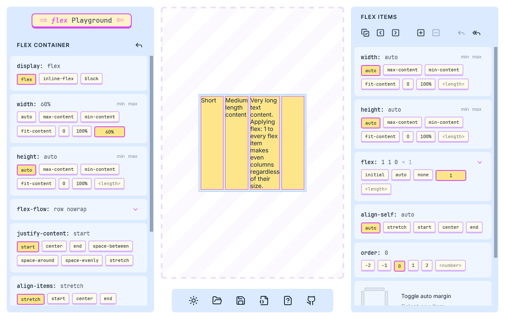

# Flex Playground

An interactive CSS Flexbox playground made with React, Framer Motion and Vite.

Live demo: https://flex-playground.onrender.com/

[](https://flex-playground.onrender.com/)

## Features

- Light/Dark theme
- Load and save presets
- Get the CSS code

## Usage

Install dependencies:

```bash
npm install
```

Run:

```bash
npm run dev
```

Build:

```bash
npm run build
```

## License

Licensed under the MIT License. Check the [LICENSE](./LICENSE.md) file for details.
